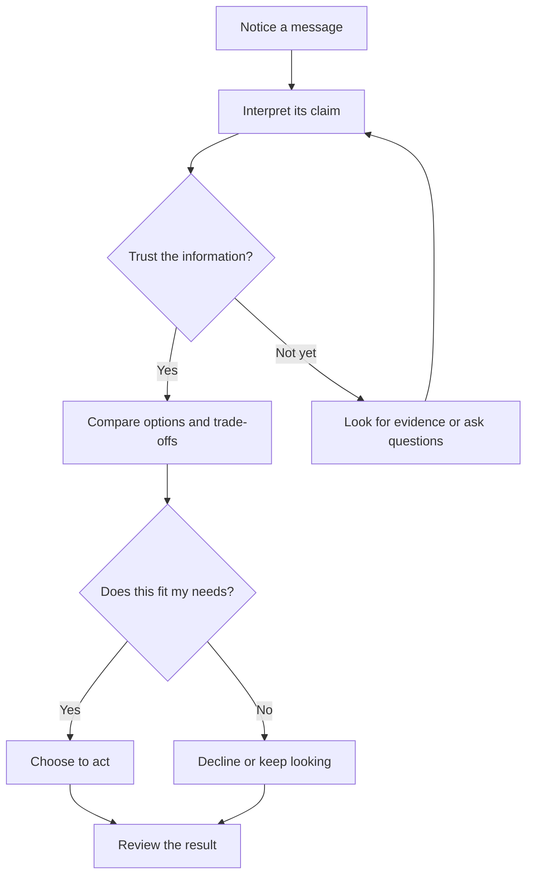

# Chapter 1: Persuasion and Human Decision-Making

Persuasion is part of ordinary life. A sign helps you notice an entrance. A friend gives you reasons to try a new restaurant. A product page helps you decide whether an item is worth buying. In each case, something influences what you notice, how you interpret it, how much you trust it, or what you do next.

For designers, persuasion is not a trick to make people agree. It is a way to communicate a point of view and help people make a decision. The ethical question is not simply whether a design influences someone; nearly every design does. The better question is whether it informs people honestly and respects their ability to choose.

## Persuasion, Coercion, and Manipulation

Persuasion uses reasoning, evidence, emotional meaning, or a clear presentation to invite someone toward a choice. The person can understand the appeal and decide for themselves.

Coercion pressures someone through a threat or penalty. The choice may technically exist, but the cost of refusing is deliberately made frightening or severe.

Manipulation steers someone by hiding important information, exploiting a vulnerability, or making a choice difficult to understand or avoid. It can look like persuasion on the surface, but it weakens informed choice.

Imagine a plain white T-shirt. A seller might describe its fabric, price, fit, and care instructions, then explain why it could suit a buyer. That is persuasion. If a buyer is told they will lose access to an important service unless they buy the shirt, that is coercive pressure. If the page falsely claims that only one shirt remains, or quietly adds a fee at checkout, that is manipulation.

## Cialdini's Principles of Influence

Psychologist Robert Cialdini describes seven principles that help explain why certain appeals can influence people. They are patterns, not guarantees: people respond differently depending on the situation, their experience, and their goals.

- **Reciprocity:** People often feel inclined to return a favor or respond to a gift. A useful free guide can build goodwill; presenting a gift as creating a debt can pressure people.
- **Commitment and consistency:** People tend to value actions that fit commitments they have made. A person who chooses a repairable product may prefer brands that support repair. A small initial agreement should not be used to trap someone into a much larger one.
- **Social proof:** When uncertain, people often look to what others do. Verified customer reviews can help someone judge a shirt's fit; invented reviews or misleading popularity claims exploit that shortcut.
- **Authority:** People may give weight to relevant expertise or credible sources. Clear information from a qualified textile specialist can help; borrowed titles or irrelevant endorsements can mislead.
- **Liking:** People are more open to people and groups they like or identify with. A relatable model can help shoppers picture how a shirt might fit into their lives; manufactured intimacy can blur the line between a genuine relationship and a sales tactic.
- **Scarcity:** People may value an opportunity more when it is limited or hard to obtain. A real end date for a seasonal sale can be useful to know; fake countdowns and false low-stock notices create pressure.
- **Unity:** People can be influenced by a sense of shared identity or belonging. A campaign could connect a shirt to a real community project; implying that someone must buy to belong turns identity into leverage.

## More Ways to Understand Decisions

### Framing

Framing is the way a choice or piece of information is presented. The same facts can lead people to notice different aspects of a decision. Calling a shirt “lightweight for warm days” emphasizes comfort; calling the same shirt “a simple layer under a jacket” emphasizes versatility. Neither description changes the physical shirt. Both should still be accurate, and important facts such as price, material, and fit should remain easy to find.

### Choice Architecture

Choice architecture is the way options are arranged and the way a decision is made easier or harder. A clothing page might let visitors compare sizes, materials, and prices side by side. A clearly labeled default size guide can reduce friction, but a preselected add-on that quietly raises the price can take advantage of inattention. Good choice architecture helps people act on their own goals; it does not hide alternatives or make refusal unusually difficult.

### Ethos, Pathos, and Logos

Classical rhetoric offers another useful lens. **Ethos** concerns a communicator's credibility, **pathos** concerns emotional appeal, and **logos** concerns reasoning and evidence. A T-shirt description could establish credibility with accurate material details, appeal emotionally to someone who values simplicity, and give practical reasons such as price and care requirements. These appeals can work together, but emotion should not substitute for evidence when a claim needs proof.

## Influence in Practice

| Principle or concept | Mechanism | Ethical use | Misuse risk |
| --- | --- | --- | --- |
| Reciprocity | A favor can create a desire to return it. | Offer a genuinely useful size or care guide with no obligation. | Make a “free” gift feel like a debt or hide conditions. |
| Commitment and consistency | People tend to align choices with commitments. | Help customers compare the shirt with values they have stated, such as durability. | Use a small yes to push an unrelated or costly commitment. |
| Social proof | Others' behavior can guide a decision under uncertainty. | Show genuine reviews with enough context to assess them. | Fabricate reviews or imply popularity without evidence. |
| Authority | Credible expertise can reduce uncertainty. | Attribute accurate fabric or care advice to a relevant expert. | Use misleading credentials or irrelevant endorsements. |
| Liking | Familiarity and affinity can increase receptiveness. | Use an authentic voice and representative images. | Manufacture closeness or target people through false affinity. |
| Scarcity | Limited access can make an option feel more valuable. | State a real sale deadline or genuinely limited supply. | Invent urgency with false countdowns or stock claims. |
| Unity | Shared identity can make an appeal feel personally relevant. | Connect a real community effort to people who choose to participate. | Suggest purchase is required to belong or prove identity. |
| Framing | Presentation changes which aspects people notice. | Describe truthful benefits while keeping trade-offs visible. | Emphasize a favorable angle to conceal important facts. |
| Choice architecture | Arrangement affects which options are easy to see or select. | Make sizes, prices, and alternatives straightforward to compare. | Hide costs, preselect unwanted extras, or obstruct refusal. |
| Ethos, pathos, logos | Credibility, emotion, and reasoning shape an argument. | Combine trustworthy information, relevant feeling, and sound reasons. | Use emotion or authority to distract from weak or missing evidence. |

## A Simple Decision Journey

A designer cannot control every step in another person's decision. This diagram shows one possible journey and where a design can support informed choice.

For the white T-shirt, the notice might be a product photo. The interpretation could be “this looks easy to wear.” Trust depends on whether the material, price, and photos are represented honestly. Comparison includes other shirts and the option not to buy. The shopper's final action belongs to the shopper, not the design.

## Ethical Cautions

Influence is not automatically ethical just because a choice is technically available. A designer should consider who benefits, who bears the cost, and whether the audience has enough information and time to decide.

Be especially careful when designing for children, people in financial or emotional distress, or anyone facing a power imbalance. Do not disguise advertising as neutral advice. Make material terms, limitations, fees, and data practices clear. Avoid invented urgency, fabricated evidence, and interfaces that make opting out harder than opting in. A useful test is to imagine explaining the design tactic openly to the people it affects. If the explanation would undermine the tactic, that is a reason to rethink it.

## Questions to Ask Before Trying to Persuade

- What action am I asking someone to take, and why?
- Is this action genuinely useful to the person, or mainly useful to the organization?
- Are my claims accurate, and can people find the evidence and important trade-offs?
- Am I using urgency, social pressure, authority, or identity honestly?
- Can someone understand the options, say no, and change their mind without unusual difficulty?
- Who might be more vulnerable to this message, and what harm could result?
- Would I be comfortable explaining this design choice plainly to the audience?

## Explore Further

These search suggestions can help you find reliable introductions and primary materials without relying on invented links:

- Search for Robert Cialdini's descriptions of the seven principles of influence.
- Search for introductory explanations of framing effects and choice architecture from a university or behavioral-science organization.
- Search for rhetoric resources that explain ethos, pathos, and logos, and compare how different sources define them.

## What You Should Remember

Persuasion shapes attention, interpretation, trust, and action, but it should leave room for informed choice. Cialdini's principles and concepts such as framing, choice architecture, and rhetoric help explain how influence works. Use them to clarify real value, not to conceal facts or pressure people. The same white T-shirt can be presented as comfortable, versatile, or simple without changing the product; ethical design makes sure the framing stays truthful and the decision stays with the person wearing it.